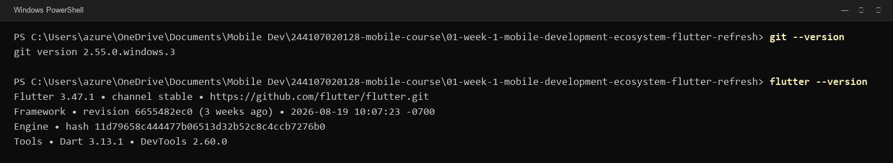
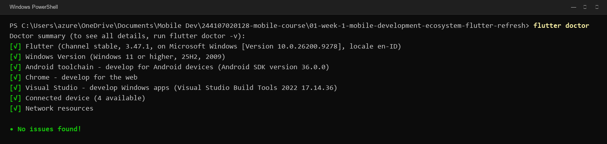
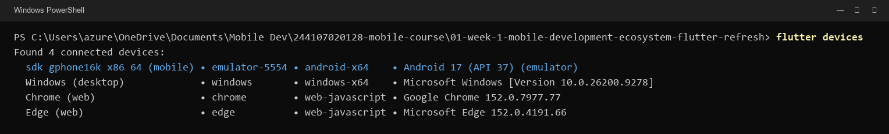
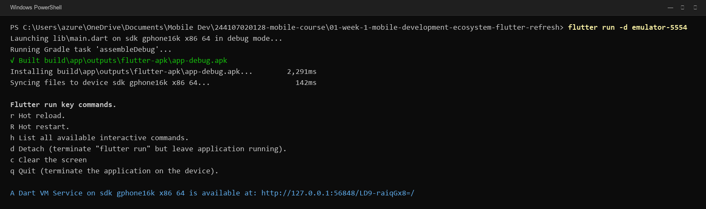
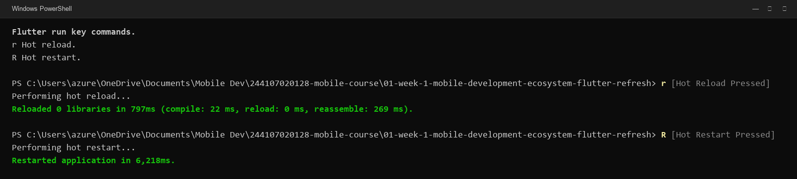
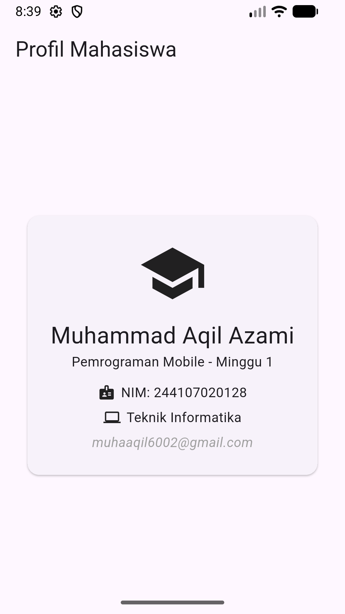
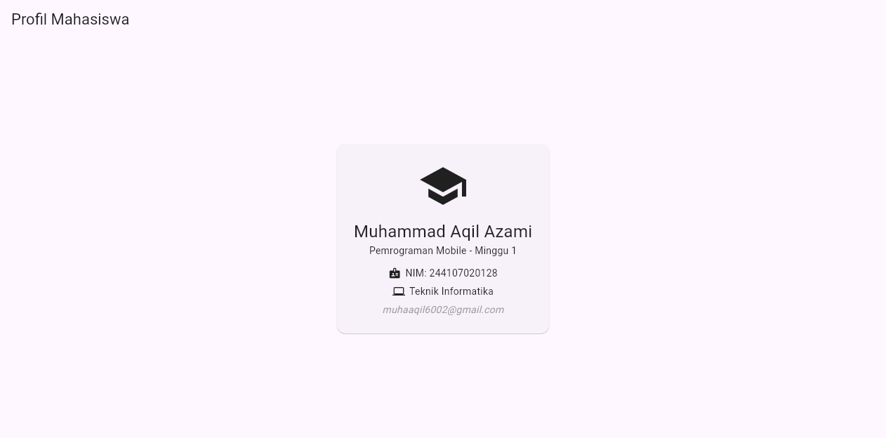
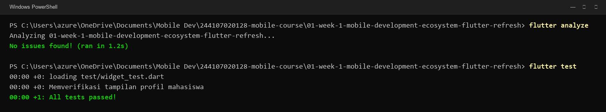
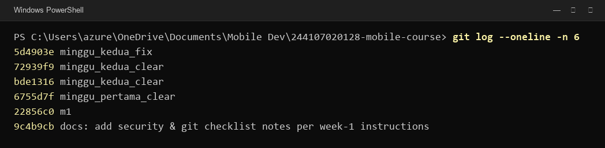
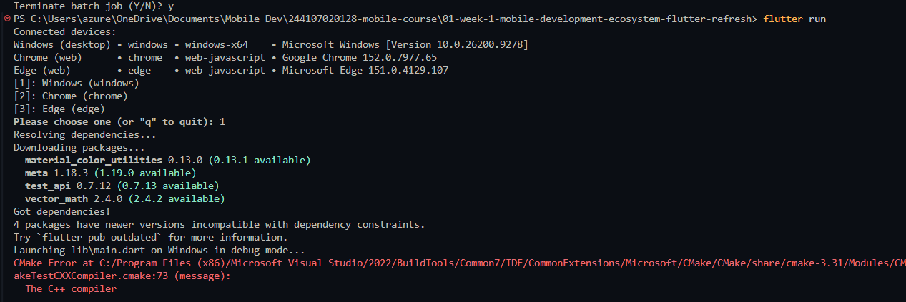

# Minggu 01 — Mobile Development Ecosystem & Flutter Refresh

* **Nama:** Muhammad Aqil Azami
* **NIM:** 244107020128
* **Kelas:** TI-3H
* **Program Studi:** D4 Teknik Informatika
* **Mata Kuliah:** Pemrograman Mobile
* **Repository:** [244107020128-mobile-course](https://github.com/M-Aqilaz/244107020128-mobile-course)

---

## 1. Tujuan Praktikum

1. Memahami ekosistem pengembangan mobile (native, hybrid, cross-platform) dan keunggulan Flutter.
2. Menyegarkan kembali dasar sintaks Dart, *null safety*, serta struktur *widget tree*.
3. Menyiapkan dan memverifikasi environment Flutter menggunakan `flutter doctor` dan `flutter devices`.
4. Membangun aplikasi Flutter pertama (Profil Mahasiswa) dengan Material 3.
5. Memahami dan menguji mekanisme **Hot Reload** serta **Hot Restart**.
6. Mengatur struktur repositori Git portofolio terstruktur untuk kebutuhan satu semester.

---

## 2. Ringkasan Konsep & Teori

* **Pendekatan Pengembangan Mobile:**
  * *Native* (Kotlin/Swift): Performa maksimal dan akses perangkat keras langsung, namun butuh *codebase* terpisah.
  * *Hybrid* (Ionic/Cordova): Berbasis web view dengan performa terbatas.
  * *Cross-platform* (Flutter): Satu *codebase* Dart untuk berbagai platform dengan performa tinggi via mesin rendering Impeller/Skia.
* **Dasar Dart & Null Safety:**
  * Dart menerapkan sistem *sound null safety*. Variabel secara default non-nullable kecuali dideklarasikan dengan tanda `?` (misal `String? email`), dan ditangani dengan operator aman seperti `??` atau `?.`.
* **UI Deklaratif & Widget Tree:**
  * Tampilan aplikasi merupakan fungsi dari state (`UI = f(state)`). Widget tersusun secara hierarkis dalam pohon widget: `MaterialApp` → `Scaffold` → `Center` → `Card` → `Column` → `Row` → `Text`.

---

## 3. Langkah Praktikum 1: Menyiapkan Environment

### A. Verifikasi Versi Git dan Flutter
Memastikan Git dan Flutter SDK telah terpasang pada sistem operasi dan terdaftar pada *system PATH*.

```powershell
git --version
flutter --version
```



### B. Diagnostik Environment (`flutter doctor`)
Menjalankan perintah `flutter doctor` untuk memeriksa kesiapan komponen toolchain Android, Chrome, dan sistem:

```powershell
flutter doctor
```



*Hasil diagnosa: Seluruh komponen (Flutter, Windows, Android toolchain, Chrome, VS Tools, Devices) berstatus centang hijau (`• No issues found!`).*

### C. Deteksi Perangkat Target (`flutter devices`)
Memastikan perangkat target (Android Emulator, Web, dan Desktop) terdeteksi oleh Flutter CLI:

```powershell
flutter devices
```



---

## 4. Langkah Praktikum 2: Menjalankan Aplikasi & Eksperimen Fitur

### A. Menjalankan Aplikasi Pertama (`flutter run`)
Menjalankan aplikasi ke Android Emulator (`sdk gphone16k x86 64`):

```powershell
cd "01-week-1-mobile-development-ecosystem-flutter-refresh"
flutter run -d emulator-5554
```



### B. Eksperimen Hot Reload & Hot Restart
Menguji perubahan kode tampilan secara langsung menggunakan fitur Hot Reload dan Hot Restart dari terminal:



**Perbandingan Hot Reload vs Hot Restart:**

| Pembeda | Hot Reload (`r`) | Hot Restart (`R`) |
| :--- | :--- | :--- |
| **Mekanisme** | Menyuntikkan kode baru ke Dart VM dan merekonstruksi widget tree. | Memuat ulang seluruh aplikasi dari fungsi `main()`. |
| **State Aplikasi** | **Dipertahankan** (*state* data pengguna tetap ada). | **Direset** (*state* kembali ke inisialisasi awal). |
| **Durasi Eksekusi** | Sangat cepat (~797 ms). | Cepat (~6 detik untuk cold restart pada emulator). |
| **Penggunaan** | Penyesuaian tata letak UI, warna, teks, padding, atau styling. | Perubahan logika inisialisasi state, konstruktor, atau tema global. |

---

## 5. Langkah Praktikum 3: Struktur Kode & Hasil Tampilan Aplikasi

### A. Struktur Widget Profil ([`lib/main.dart`](lib/main.dart))
Aplikasi dimodifikasi dari template default menjadi kartu profil mahasiswa:
* `Scaffold` & `AppBar`: Menyediakan kerangka halaman dan bilah judul (*"Profil Mahasiswa"*).
* `Center`: Memposisikan kartu profil di tengah layar.
* `Card` & `Padding`: Wadah berbingkai elevasi dengan bantalan dalam 24 px.
* `Column`: Mengatur susunan vertikal ikon akademik (`Icons.school`), nama lengkap, dan subjudul.
* `Row`: Mengatur informasi baris horizontal untuk NIM (`Icons.badge`), Jurusan (`Icons.computer`), dan email mahasiswa.

### B. Tangkapan Layar Aplikasi

#### 1. Tampilan pada Android Emulator (Mobile)


#### 2. Tampilan pada Web (Google Chrome)


---

## 6. Langkah Praktikum 4: Pengujian Mutu Kode & Git Portfolio

### A. Analisis Kode & Pengujian Widget Test
Memverifikasi tidak ada peringatan/kesalahan kode (`flutter analyze`) dan menjalankan unit widget test ([`test/widget_test.dart`](test/widget_test.dart)) untuk memvalidasi teks profil dan ikon:

```powershell
flutter analyze
flutter test
```



*Keterangan: Kode bersih tanpa isu (0 warning) dan seluruh widget test berhasil lolos (`All tests passed!`).*

### B. Riwayat Commit Repositori (`git log`)
Mendokumentasikan progres pengerjaan pada Git portofolio menggunakan pesan commit yang terstruktur:

```powershell
git log --oneline -n 6
```



---

## 7. Kendala Setup dan Solusi

### Kendala yang Ditemui:
Saat awal eksekusi pada lingkungan desktop Windows (`flutter run -d windows`), terjadi error kompilasi Visual Studio C++ CMake:



### Analisis Penyebab:
Berdasarkan log error `The C++ compiler ... is not able to compile a simple test program`, paket komponen compiler C++ CMake pada Visual Studio Build Tools belum terkonfigurasi secara lengkap untuk target native Windows desktop.

### Solusi:
1. Mengalihkan target pengujian langsung ke **Web (Chrome)** dan **Android Emulator** yang sudah terkonfigurasi lengkap.
2. Memverifikasi Android SDK, build-tools, dan lisensi melalui `flutter doctor --android-licenses` untuk memastikan kelancaran praktikum berikutnya.

---

## 8. Refleksi

1. **Kapan native lebih tepat dipilih daripada cross-platform?**  
   *Jawab:*  
   Pendekatan native (Kotlin/Swift) tepat digunakan jika aplikasi membutuhkan performa grafis ekstrem (misal 3D gaming), integrasi intensif dengan hardware tingkat rendah (driver Bluetooth BLE khusus, pemrosesan kamera low-level, sensor IoT kustom), atau saat fitur OS paling mutakhir harus langsung diadopsi pada hari peluncuran. Untuk aplikasi bisnis, e-commerce, portal akademik, dan dashboard produktivitas, *cross-platform* (Flutter) memberikan efisiensi biaya dan waktu yang jauh lebih baik.

2. **Bagaimana perubahan state berhubungan dengan widget tree dan UI deklaratif?**  
   *Jawab:*  
   Dalam UI deklaratif, representasi visual dirumuskan sebagai `UI = f(state)`. Saat terjadi perubahan data/state, framework Flutter akan memicu proses *rebuild* pada bagian sub-pohon (*subtree*) widget yang terpengaruh, kemudian membandingkan *element tree* lama dengan yang baru (*diffing*) untuk merender ulang hanya elemen yang berubah secara efisien.

3. **Mengapa commit kecil dengan pesan yang jelas bermanfaat bagi pekerjaan tim dan portfolio?**  
   *Jawab:*  
   Commit yang kecil dan bermakna mempermudah penelusuran histori perubahan (*traceability*), mempercepat proses peninjauan kode (*code review*), dan memudahkan isolasi kesalahan (*debugging* atau *git bisect/revert*). Pada portofolio akademik, histori commit yang rapi membuktikan proses belajar mahasiswa secara bertahap dan autentik.
