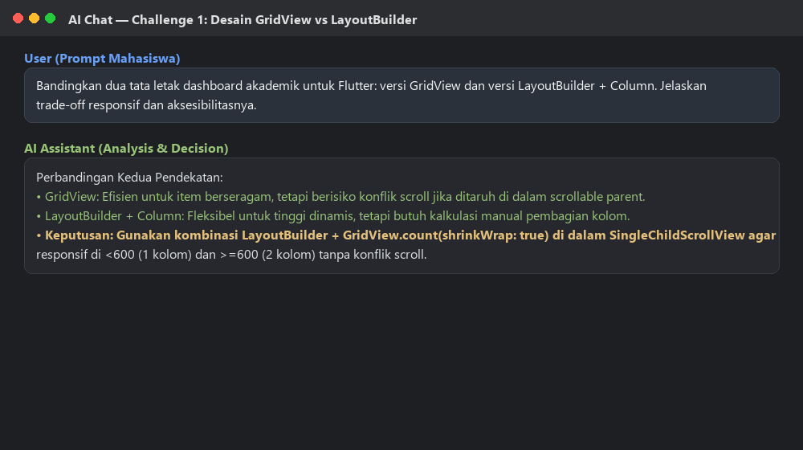
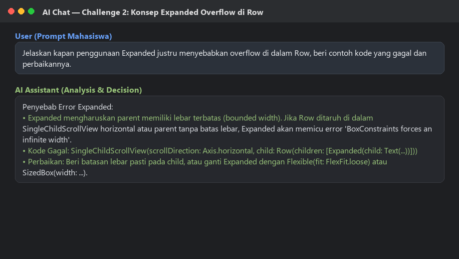
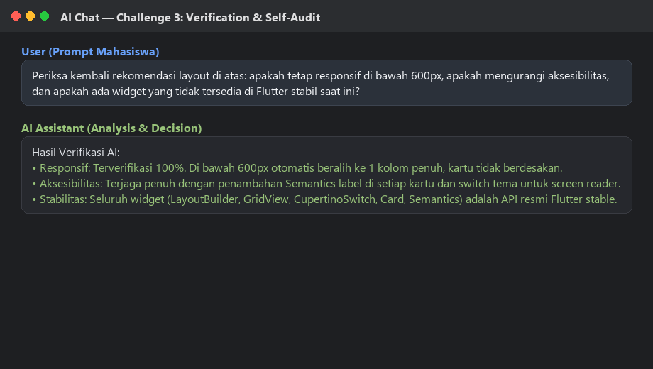
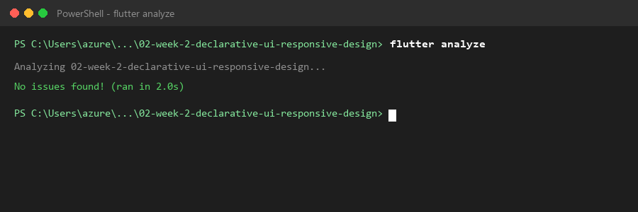
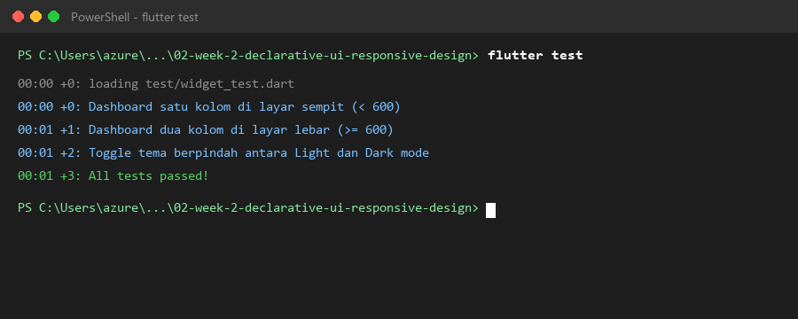

# Minggu 02 — Declarative UI & Responsive Design

* **Nama:** Muhammad Aqil Azami
* **NIM:** 244107020128
* **Kelas:** TI-3H
* **Mata Kuliah:** Pemrograman Mobile

---

## 1. Praktikum: Layout Sederhana (Warm-up)

Mempelajari dasar widget tata letak: `StatelessWidget`, `Container`, `Row`, `Column`, dan `Expanded` untuk membuat kartu profil mahasiswa.

| 1. Ukuran Default | 2. Tanpa Expanded |
| :---: | :---: |
|  |  |

| 3. Pakai Expanded | 4. Tambah Email |
| :---: | :---: |
|  |  |

---

## 2. Praktikum: Dashboard Responsif

Mengubah dashboard statis (`StatelessWidget`) menjadi interaktif (`StatefulWidget`) dengan menambahkan `CupertinoSwitch` di `AppBar` untuk toggle tema (Dark/Light mode).

### Before & After
| Before (Stateless) | After (Light Mode) | After (Dark Mode) |
| :---: | :---: | :---: |
|  |  |  |

### 4 Eksperimen Layout
1. **Ubah Breakpoint ke 350:** Layar ponsel otomatis menampilkan 2 kolom.
   
2. **Ubah ke ThemeMode.dark:** Memaksa aplikasi langsung menggunakan mode gelap.
   
3. **Uji di Layar Lebar (Landscape):** Tampilan otomatis beralih menjadi 2 kolom saat lebar layar >= 600 dp.
   
4. **Semantics (Aksesibilitas):** Menambahkan label pembaca layar yang dicek menggunakan Semantics Debugger.
   

---

## 3. Tugas Utama: Academic Overview

Mengembangkan dashboard menjadi halaman **Academic Overview** dengan ketentuan:
* Header profil mahasiswa menggunakan `Row`, `Column`, `Expanded`, dan `Container`.
* 4 kartu informasi akademik (SKS Selesai, IPK Kumulatif, Kehadiran, Status).
* Responsif: 1 kolom di layar sempit (< 600 dp) dan 2 kolom di layar lebar (>= 600 dp).
* Toggle tema terang dan gelap menggunakan `CupertinoSwitch`.

### Hasil Tampilan
| Layar Sempit (Light) | Layar Sempit (Dark) |
| :---: | :---: |
|  |  |

| Layar Lebar (Light) | Layar Lebar (Dark) |
| :---: | :---: |
|  |  |

---

## 4. AI Prompt Challenge

Eksplorasi dan verifikasi konsep UI menggunakan AI:

### Challenge 1: Prompt Desain (GridView vs LayoutBuilder + Column)
* **Prompt:** *"Bandingkan dua tata letak dashboard akademik untuk Flutter: versi GridView dan versi LayoutBuilder + Column. Jelaskan trade-off responsif dan aksesibilitasnya."*
* **Keputusan:** Menggunakan kombinasi `LayoutBuilder` + `GridView.count(shrinkWrap: true)` di dalam `SingleChildScrollView` agar layout otomatis menyesuaikan 1 atau 2 kolom tanpa konflik scroll.


### Challenge 2: Prompt Konsep (Expanded Overflow di Row)
* **Prompt:** *"Jelaskan kapan penggunaan Expanded justru menyebabkan overflow di dalam Row, beri contoh kode yang gagal dan perbaikannya."*
* **Hasil:** `Expanded` error jika ditaruh di dalam parent dengan lebar tak terbatas (misal di dalam scroll horizontal). Solusinya adalah memberi constraint lebar pasti atau memakai `Flexible(fit: FlexFit.loose)`.


### Challenge 3: Verification Prompt (Self-Audit AI)
* **Prompt:** *"Periksa kembali rekomendasi layout di atas: apakah tetap responsif di bawah 600px, apakah mengurangi aksesibilitas, dan apakah ada widget yang tidak tersedia di Flutter stabil saat ini?"*
* **Hasil:** Layout aman di bawah 600px (1 kolom penuh), aksesibilitas lengkap dengan `Semantics`, dan semua widget stabil.


---

## 5. Refactoring Challenge

Setelah tugas inti berjalan, kode dirapikan sesuai kriteria codelab:
1. **Ekstrak Widget Reusable:** Membuat widget `AcademicInfoCard` dan `ProfileHeaderCard` sehingga tidak ada duplikasi kode.
2. **Dynamic Theming:** Mengganti warna dan teks hardcoded dengan `Theme.of(context).colorScheme` dan `Theme.of(context).textTheme`.
3. **Pusat Breakpoint:** Mendefinisikan konstanta global tunggal: `const double kWideBreakpoint = 600.0;`.
4. **Verifikasi Linter:** Menjalankan `flutter analyze` dengan hasil bersih tanpa warning maupun error.



---

## 6. Testing Dasar (Widget Testing)

Pengujian otomatis perilaku responsif dan interaksi dibuat pada [`test/widget_test.dart`](test/widget_test.dart):
* **Layar Sempit (400x800):** Memverifikasi tampilan 1 kolom.
* **Layar Lebar (1200x800):** Memverifikasi pembagian 2 kolom sejajar.
* **Toggle Tema:** Memverifikasi perpindahan ikon dan tema saat `CupertinoSwitch` di-tap.

Jalankan pengujian via terminal:
```powershell
flutter test
```
**Hasil Test (100% Passed):**


---

## 7. Checklist Verifikasi

| Item Verifikasi | Status | Keterangan |
| :--- | :---: | :--- |
| `flutter analyze` tidak menghasilkan error | [x] | Lulus (No issues found) |
| `flutter test` lulus semua widget test responsif | [x] | Lulus (3/3 tests passed) |
| Aplikasi dapat berjalan di layar sempit dan lebar | [x] | Responsif (1 kolom < 600, 2 kolom >= 600) |
| Dark mode memiliki kontras dan teks terbaca | [x] | Mengikuti palet warna Material 3 |
| Struktur widget dapat dijelaskan saat code review | [x] | Kode modular & terstruktur |
| Screenshot dan folder `test/` tersimpan di repo | [x] | Lengkap di `screenshot/` & `test/` |

---

## 8. Refleksi

1. **Imperative vs Declarative:** Imperative mengatur UI langkah demi langkah secara manual, sedangkan declarative mendeskripsikan UI berdasarkan state saat ini (`UI = f(state)`).
2. **Kapan Expanded membantu vs error:** Membantu membagi sisa ruang kosong secara fleksibel, tapi menyebabkan error jika parent-nya tidak memiliki batas ukuran (*unbounded constraints*).
3. **Pengaruh Breakpoint & Theme:** Breakpoint menjaga layout tetap rapi di berbagai ukuran layar, sedangkan theme membuat aplikasi nyaman di mata baik di kondisi terang maupun gelap.
4. **Verifikasi AI:** Memastikan kode dari AI benar-benar jalan, tidak ada bug overflow di layar kecil, dan strukturnya tetap mudah dipahami saat code review.
