# Minggu 02 — Declarative UI & Responsive Design

* **Nama:** Muhammad Aqil Azami
* **NIM:** 244107020128
* **Kelas:** TI-3H
* **Mata Kuliah:** Pemrograman Mobile

---

## 1. Praktikum: Layout Sederhana (Warm-up)

Mempelajari dasar widget tata letak: `StatelessWidget`, `Container`, `Row`, `Column`, dan `Expanded` untuk membuat kartu profil mahasiswa.

| 1. Ukuran Default | 2. Tanpa Expanded |
| :---: | :---: |
| 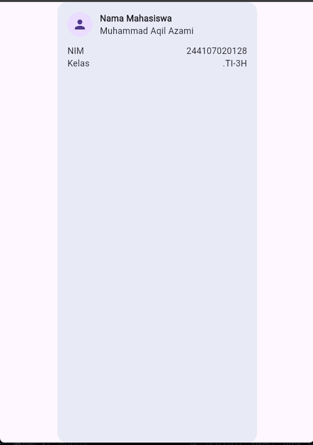 | 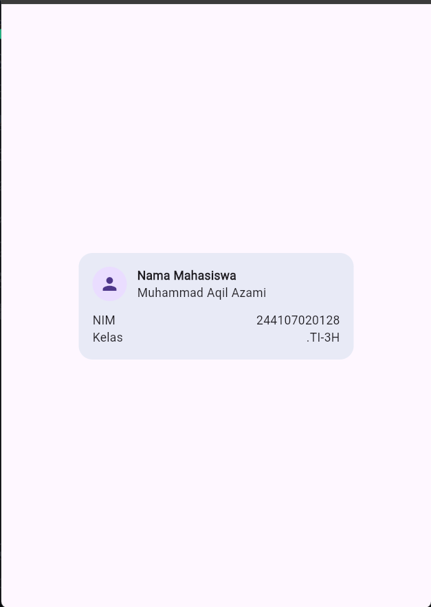 |

| 3. Pakai Expanded | 4. Tambah Email |
| :---: | :---: |
| 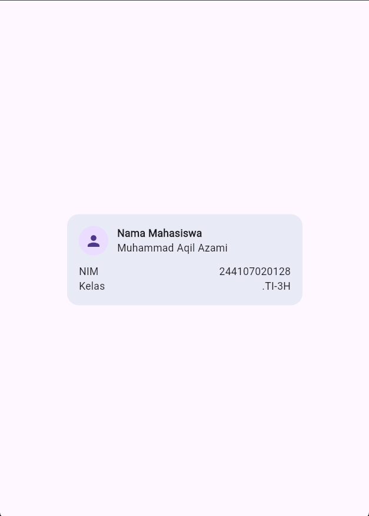 | 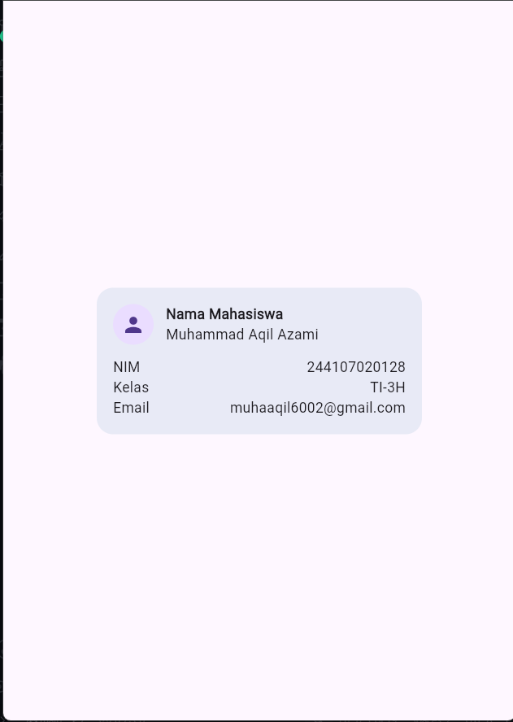 |

---

## 2. Praktikum: Dashboard Responsif

Mengubah dashboard statis (`StatelessWidget`) menjadi interaktif (`StatefulWidget`) dengan menambahkan `CupertinoSwitch` di `AppBar` untuk toggle tema (Dark/Light mode).

### Before & After
| Before (Stateless) | After (Light Mode) | After (Dark Mode) |
| :---: | :---: | :---: |
| 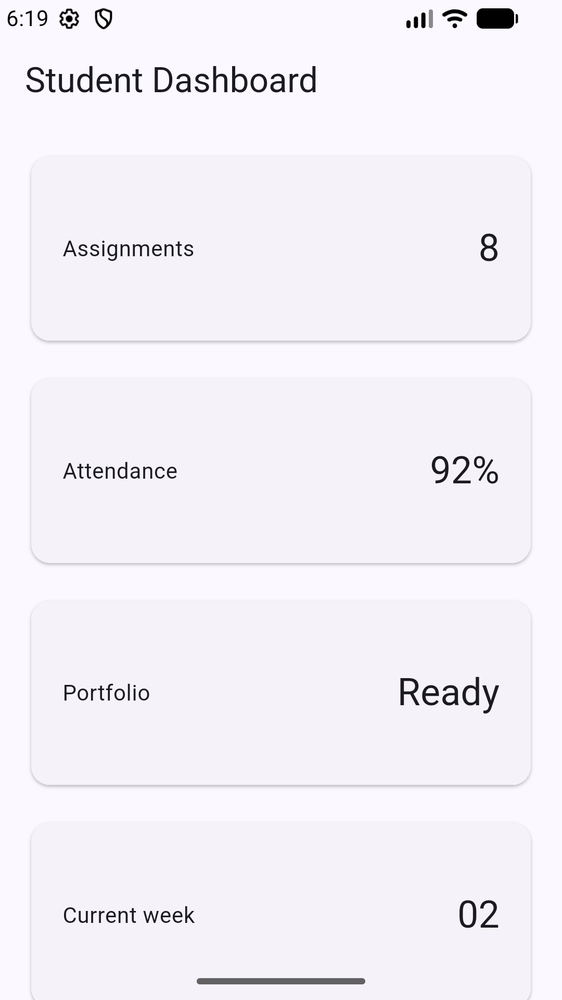 | 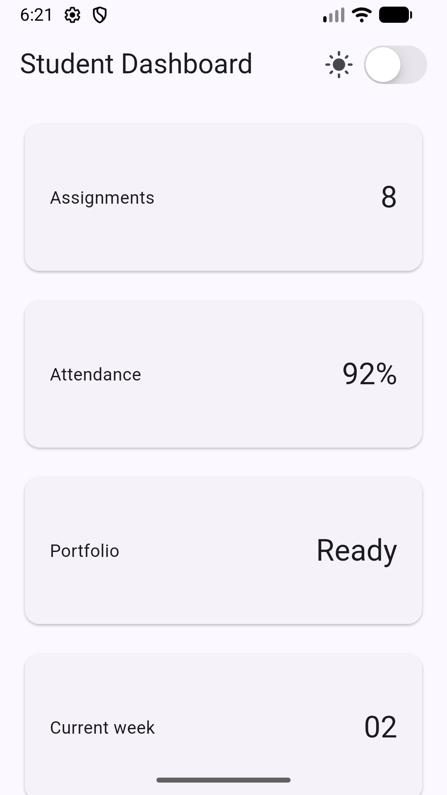 | 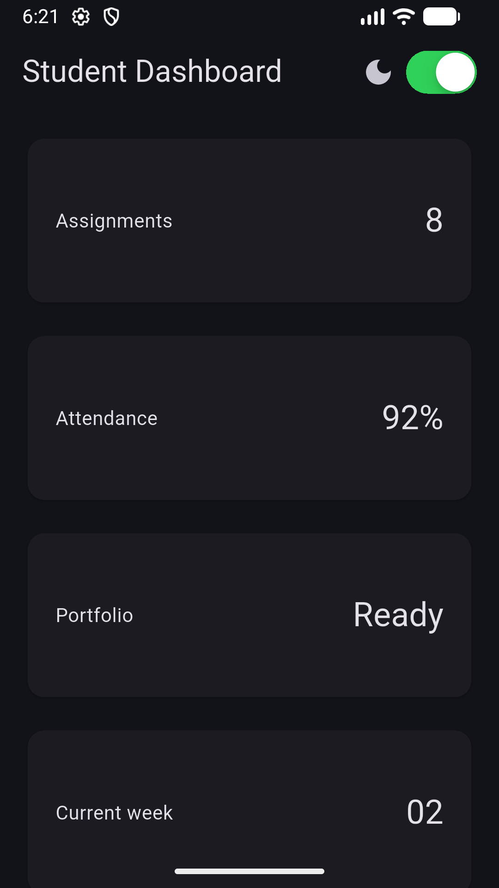 |

### 4 Eksperimen Layout
1. **Ubah Breakpoint ke 350:** Layar ponsel otomatis menampilkan 2 kolom.
   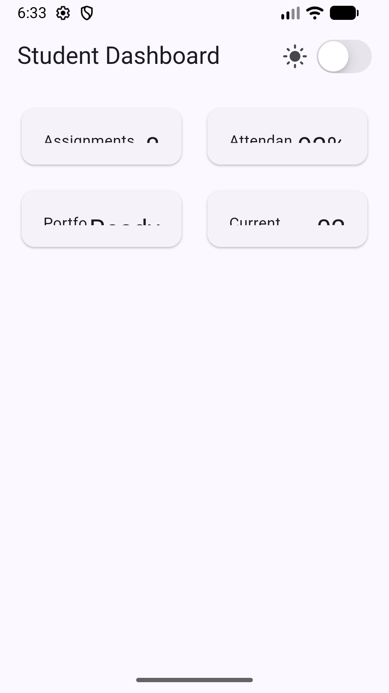
2. **Ubah ke ThemeMode.dark:** Memaksa aplikasi langsung menggunakan mode gelap.
   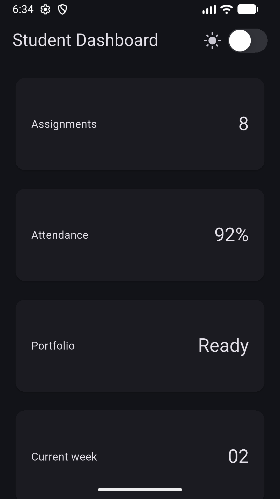
3. **Uji di Layar Lebar (Landscape):** Tampilan otomatis beralih menjadi 2 kolom saat lebar layar >= 600 dp.
   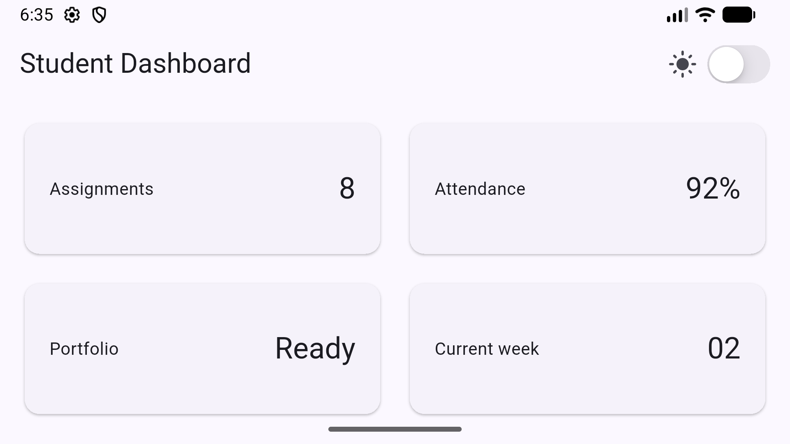
4. **Semantics (Aksesibilitas):** Menambahkan label pembaca layar yang dicek menggunakan Semantics Debugger.
   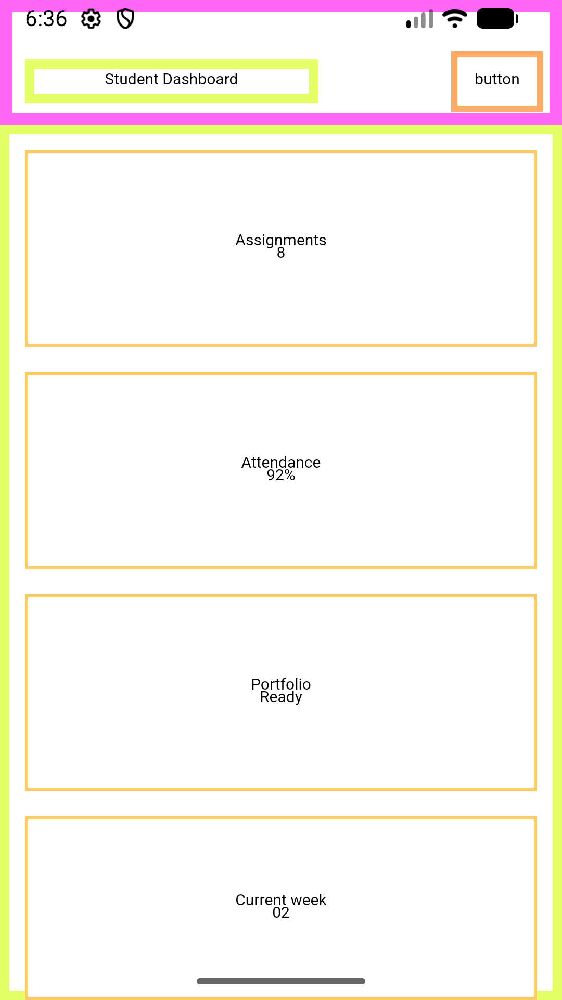

---

## 3. Tugas Utama: Academic Overview

Mengembangkan dashboard menjadi halaman **Academic Overview** dengan ketentuan:
* Header profil mahasiswa menggunakan `Row`, `Column`, `Expanded`, dan `Container`.
* 4 kartu informasi akademik (SKS Selesai, IPK Kumulatif, Kehadiran, Status).
* Responsif: 1 kolom di layar sempit (< 600 dp) dan 2 kolom di layar lebar (>= 600 dp).
* Toggle tema terang dan gelap menggunakan `CupertinoSwitch`.

### Hasil Tampilan
| Layar Sempit (Light) | Layar Sempit (Dark) |
| :---: | :---: |
| 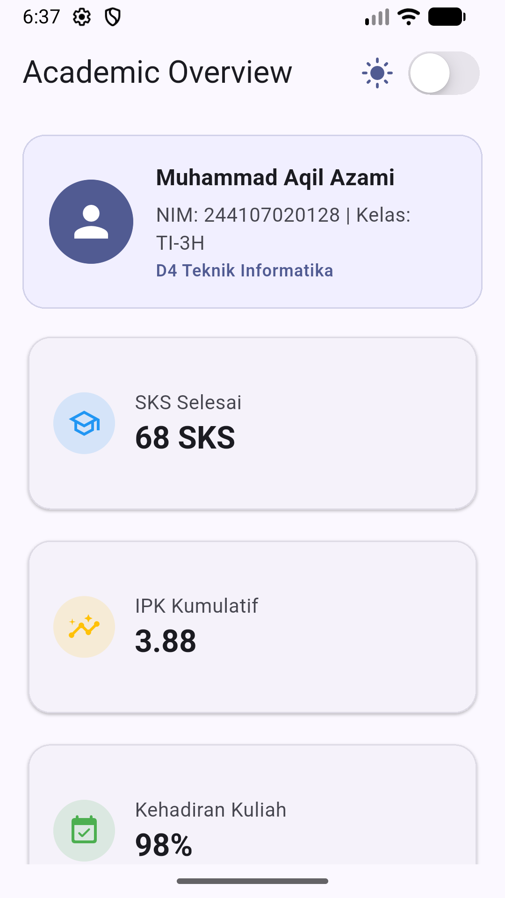 | 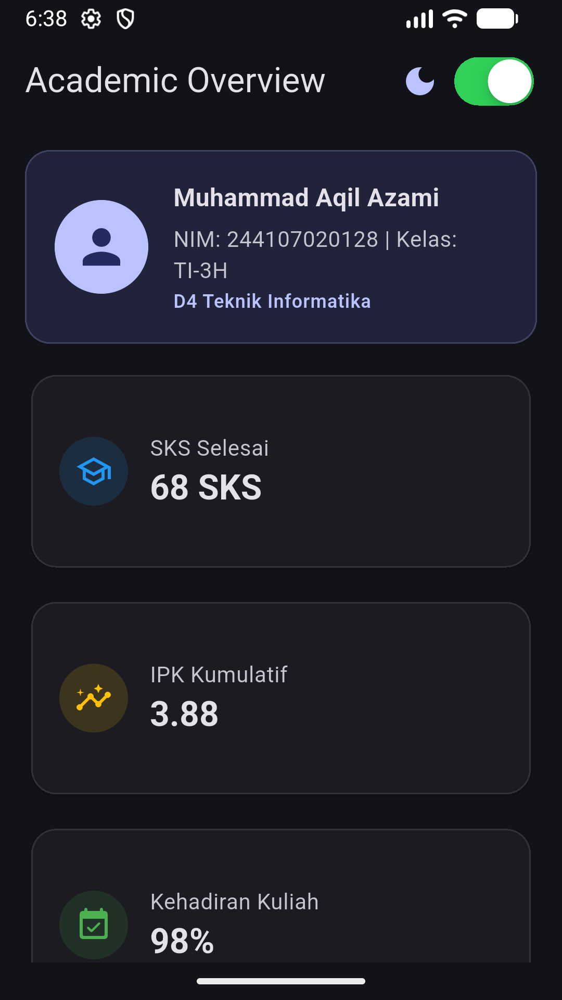 |

| Layar Lebar (Light) | Layar Lebar (Dark) |
| :---: | :---: |
| 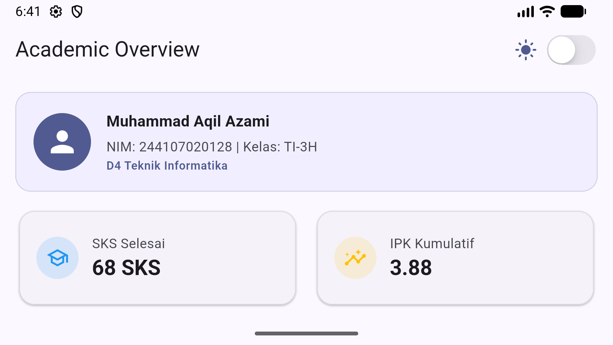 | 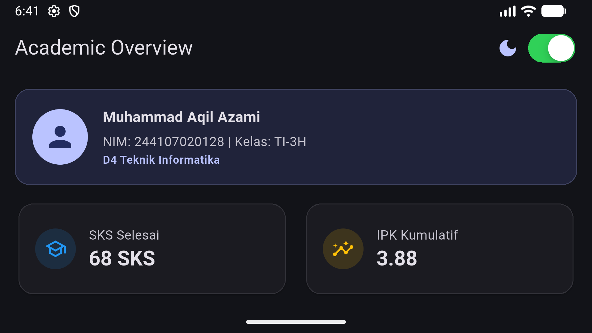 |

### Testing & Analisis
* **`flutter analyze`:** `No issues found!`
* **`flutter test`:** Lulus semua pengujian responsif dan toggle tema (`All tests passed!`).

---

## 4. AI Prompt Challenge

1. **Prompt Desain (GridView vs LayoutBuilder + Column):** Memilih `LayoutBuilder` + `GridView` karena lebih simpel membagi kolom secara responsif tanpa perlu hitung lebar card manual.
2. **Prompt Konsep (Expanded Overflow):** `Expanded` bakal error jika ditaruh di dalam parent dengan lebar tak terbatas (misal di dalam `SingleChildScrollView` horizontal).
3. **Verifikasi AI:** Layout dipastikan tetap responsif di bawah 600px, teks tidak terpotong, dan widget yang digunakan stabil di Flutter.

---

## 5. Refleksi

1. **Imperative vs Declarative:** Imperative mengatur UI langkah demi langkah secara manual, sedangkan declarative mendeskripsikan UI berdasarkan state saat ini (`UI = f(state)`).
2. **Kapan Expanded membantu vs error:** Membantu membagi sisa ruang kosong secara fleksibel, tapi menyebabkan error jika parent-nya tidak memiliki batas ukuran (*unbounded constraints*).
3. **Pengaruh Breakpoint & Theme:** Breakpoint menjaga layout tetap rapi di berbagai ukuran layar, sedangkan theme membuat aplikasi nyaman di mata baik di kondisi terang maupun gelap.
4. **Verifikasi AI:** Memastikan kode dari AI benar-benar jalan, tidak ada bug overflow di layar kecil, dan strukturnya tetap mudah dipahami saat code review.
