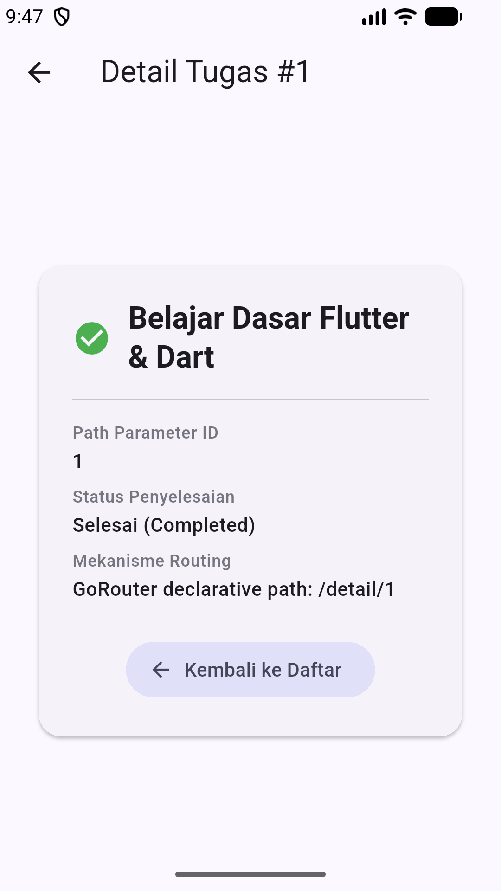
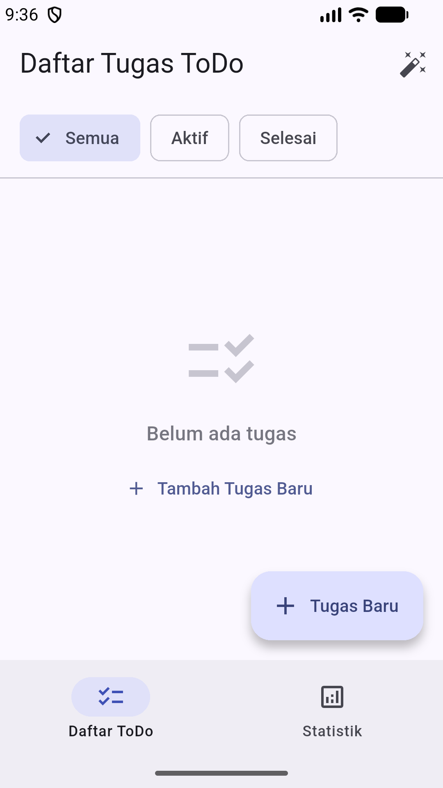
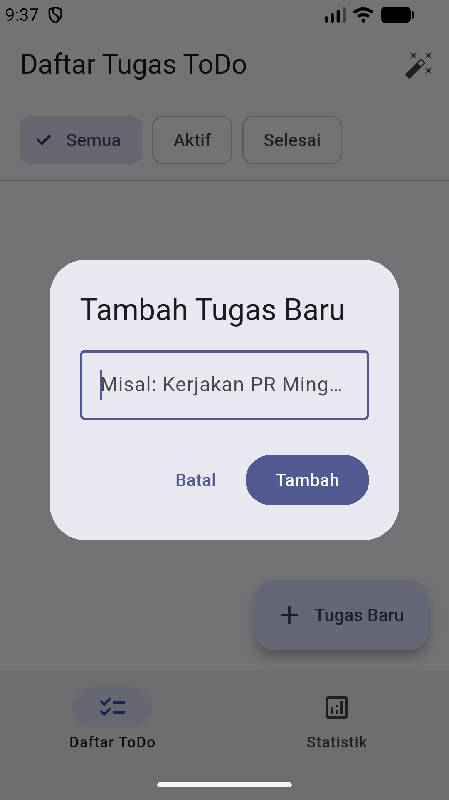
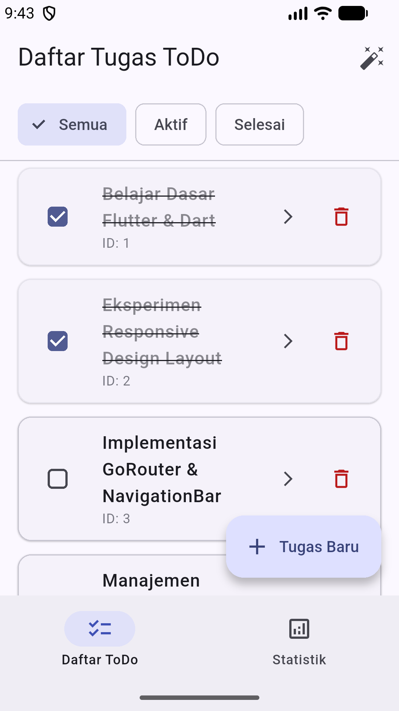
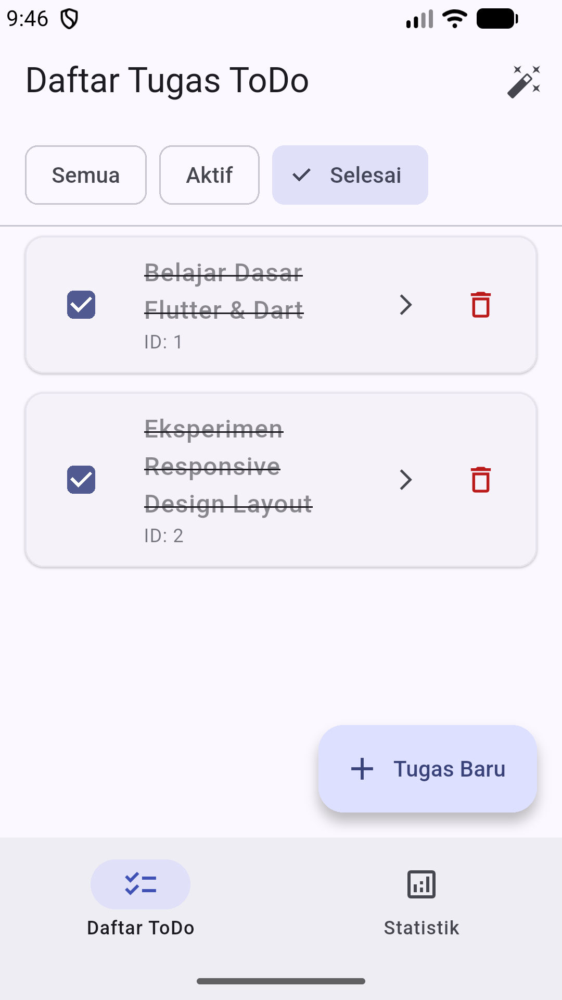
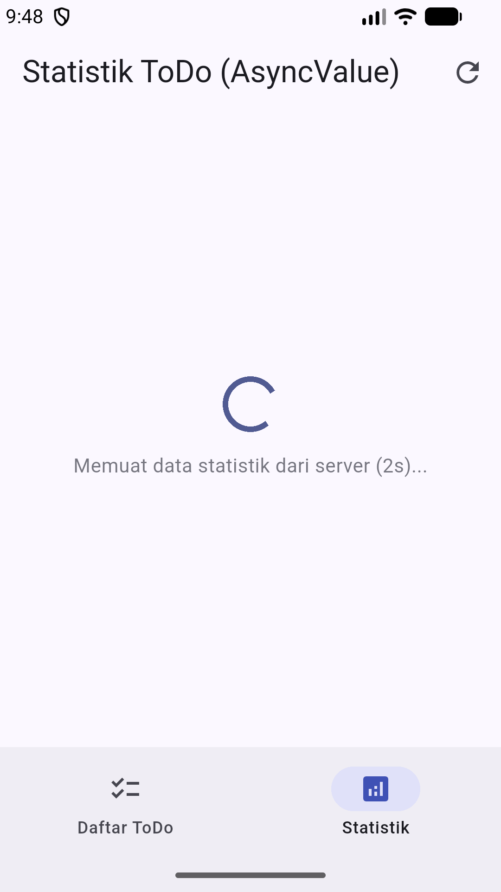
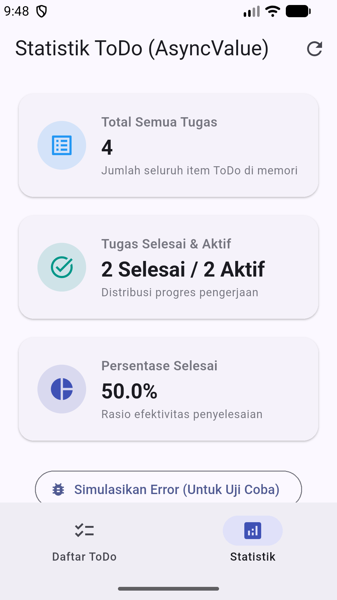
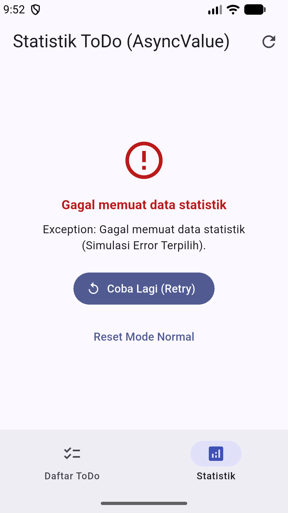
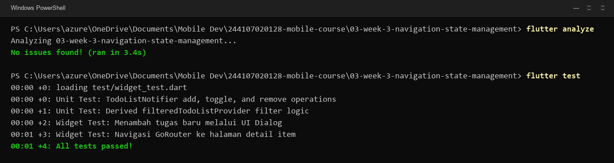

# Minggu 03 — Navigation & State Management

- **Nama:** Muhammad Aqil Azami
- **NIM:** 244107020128
- **Kelas:** TI-3H
- **Program Studi:** D4 Teknik Informatika
- **Mata Kuliah:** Pemrograman Mobile
- **Repository:** [244107020128-mobile-course](https://github.com/M-Aqilaz/244107020128-mobile-course)

---

## 1. Deskripsi Project

Pada tugas minggu ke-3 ini, saya membuat aplikasi **ToDo List** sederhana menggunakan Flutter dengan menerapkan:
1. **Navigasi dengan GoRouter**: Mengatur perpindahan rute antar halaman secara deklaratif, termasuk rute dinamis untuk melihat detail tugas berdasarkan ID.
2. **State Management dengan Riverpod**: Mengelola data daftar tugas secara global agar mudah diakses dari halaman lain tanpa harus mengoper data manual antar widget.
3. **Penanganan Async State**: Menampilkan status saat data sedang dimuat (loading), data siap ditampilkan (success), dan saat terjadi kendala (error) menggunakan `AsyncValue`.
4. **Pengujian**: Memastikan fungsionalitas logika dan tampilan berjalan lancar lewat pengujian otomatis (unit test & widget test).

### Cara Menjalankan Project

```powershell
# Masuk ke folder project
cd 03-week-3-navigation-state-management

# Mengambil dependencies
flutter pub get

# Menjalankan aplikasi
flutter run

# Menjalankan pengujian otomatis
flutter test
```

---

## 2. Praktikum 1: Navigasi dengan GoRouter

Navigasi aplikasi diatur pada file `lib/main.dart` menggunakan package `go_router`. Rute didefinisikan secara terpusat:
- `/` : Menampilkan halaman utama daftar tugas (`TodoPage`).
- `/stats` : Menampilkan ringkasan statistik (`StatsPage`).
- `/detail/:id` : Halaman detail tugas (`DetailPage`), di mana `:id` merupakan parameter dinamis sesuai tugas yang dipilih.

Halaman detail membaca ID dari URL melalui `state.pathParameters['id']` lalu mencari data tugas yang cocok di daftar. Di halaman ini juga disediakan tombol kembali untuk menuju ke halaman beranda.

| Tampilan Navigasi ke Halaman Detail |
| :---: |
|  |

---

## 3. Praktikum 2: State Management dengan Riverpod

Pengelolaan data ToDo dipusatkan di provider Riverpod (`todoListProvider`). Dengan cara ini, UI tinggal membaca data dan memanggil fungsi yang tersedia tanpa perlu mengoper data antar widget secara berjenjang.

Fitur yang sudah dibuat:
- **Tambah Tugas**: Pengguna memasukkan judul tugas baru lewat dialog pop-up.
- **Checklist Selesai**: Mengubah status tugas. Tugas yang sudah selesai teksnya otomatis dicoret.
- **Filter Tugas**: Memilih filter (Semua, Aktif, Selesai) menggunakan chip filter di bagian atas layar.

| Kondisi Awal (Daftar Masih Kosong) | Dialog Tambah Tugas Baru |
| :---: | :---: |
|  |  |

| Tampilan Daftar Tugas Aktif | Filter Menampilkan Tugas Selesai |
| :---: | :---: |
|  |  |

---

## 4. Praktikum 3: Mengelola Async State dengan AsyncValue

Di halaman statistik, kalkulasi data disimulasikan seperti mengambil data dari server dengan delay 2 detik menggunakan `AsyncNotifier` dan `AsyncValue`. Dengan fitur `when()` dari `AsyncValue`, seluruh kemungkinan status tampilan tertangani dengan baik:
- **Loading**: Menampilkan indikator loading berputar selama proses kalkulasi 2 detik.
- **Success**: Menampilkan ringkasan kartu data (Total Tugas, Tugas Selesai, dan Tugas Aktif).
- **Error**: Menampilkan pesan kesalahan jika terjadi kendala data, lengkap dengan tombol "Coba Lagi" untuk me-refresh data via `ref.invalidate(statsProvider)`.

| Kondisi Loading (Delay 2 Detik) | Kondisi Sukses (Ringkasan Statistik) |
| :---: | :---: |
|  |  |

| Kondisi Error & Tombol Coba Lagi |
| :---: |
|  |

---

## 5. Refactoring dan Eksplorasi AI

### Refactoring Kode
Beberapa perbaikan struktur kode yang saya terapkan:
1. **Membuat Widget `TodoTile`**: Memisahkan komponen item daftar tugas ke file tersendiri di `lib/widgets/todo_tile.dart`. Hal ini membuat file `todo_page.dart` lebih ringkas dan fokus ke layout halaman saja.
2. **Memisahkan Logika Filter**: Logika filter tugas dipindahkan ke `filteredTodoListProvider` di `lib/providers/todo_provider.dart`, sehingga UI tidak perlu repot melakukan filter manual di dalam method `build`.
3. **Navigasi Bawah**: Menambahkan `NavigationBar` di `lib/main.dart` agar pengguna bisa dengan mudah berpindah antara halaman ToDo dan halaman Statistik.

### Eksplorasi AI
Pada bagian ini, saya mencoba memanfaatkan AI untuk membuat rancangan awal halaman statistik (`StatsPage`) menggunakan Riverpod.
- **Rancangan dari AI**: AI berhasil membuatkan struktur dasar halaman dengan penanganan loading, error, dan success menggunakan `AsyncValue`.
- **Penyesuaian Mandiri**: Kode dari AI awalnya masih menggunakan angka statis (dummy 10 tugas). Oleh karena itu, kodenya saya modifikasi agar membaca langsung data dari `todoListProvider`, sehingga angka statistik yang tampil selalu sinkron dengan daftar ToDo yang sedang ada.
- Rincian prompt dan evaluasi kodenya dapat dilihat di [docs/ai_challenge.md](docs/ai_challenge.md).

---

## 6. Pengujian dan Validasi

Untuk memastikan aplikasi bebas dari error dan berjalan sesuai kebutuhan, saya menjalankan pengecekan linter dan pengujian otomatis:
- `flutter analyze`: Memeriksa kerapian sintaks dan memastikan tidak ada error ataupun warning linter yang tertinggal.
- `flutter test`: Menjalankan 4 pengujian otomatis di `test/widget_test.dart` yang mencakup pengujian provider ToDo, logika filter, interaksi penambahan tugas di dialog, dan navigasi ke halaman detail.

```powershell
flutter analyze
flutter test
```

| Hasil Pengecekan Linter dan Pengujian Otomatis |
| :---: |
|  |

Hasilnya, seluruh kode berstatus bersih tanpa isu (`No issues found!`) dan seluruh 4 test case berhasil lulus.

---

## 7. Refleksi

1. **Kapan `setState` masih cukup, dan kapan harus beralih ke Riverpod?**  
   `setState` masih sangat cocok untuk state lokal yang cakupannya cuma di dalam satu widget saja, misalnya mengontrol buka-tutup form dialog atau animasi tombol. Tapi kalau datanya perlu dibaca oleh halaman lain (seperti data ToDo yang juga dihitung di halaman statistik), menggunakan Riverpod jauh lebih praktis dan rapi karena kita tidak perlu repot mengoper data secara berjenjang antar widget.

2. **Apa perbedaan mendasar antara `context.go` dan `context.push` pada GoRouter?**  
   - `context.go` langsung mengganti rute dan mereset stack navigasi ke halaman tujuan. Cara ini pas digunakan saat berpindah tab di navigasi bawah atau redirect setelah login.
   - `context.push` menumpuk halaman baru di atas halaman yang sedang dibuka. Dengan begitu, tombol back di AppBar maupun tombol back bawaan HP otomatis bisa digunakan untuk kembali ke halaman sebelumnya, sangat cocok untuk membuka halaman detail tugas.

3. **Mengapa `AsyncValue` lebih aman dibandingkan mengelola status loading dan error secara manual dengan banyak variabel boolean?**  
   Kalau memakai variabel boolean manual seperti `isLoading` dan `hasError`, bisa terjadi situasi di mana kedua variabel bernilai aktif bersamaan secara tidak sengaja. Sementara `AsyncValue` memastikan statusnya selalu berada di salah satu kondisi yang pasti: sedang loading, error, atau datanya sudah siap. Hal ini membuat tampilan UI lebih terprediksi dan mencegah layar kosong mendadak.

4. **Bagian mana dari kode rekomendasi AI yang kamu tolak atau modifikasi, dan apa alasannya?**  
   Kode awal yang dibuat oleh AI untuk halaman statistik masih menggunakan data dummy statis (jumlah 10 tugas tetap). Kode tersebut saya tolak dan saya ubah agar membaca langsung data dari `todoListProvider`. Dengan penyesuaian ini, kartu statistik benar-benar menampilkan data yang akurat sesuai dengan tugas yang telah kita tambahkan di aplikasi.

---

## 8. Referensi

- [Dokumentasi Resmi GoRouter (pub.dev)](https://pub.dev/packages/go_router)
- [Dokumentasi Resmi Flutter Riverpod](https://riverpod.dev)
- [Codelab Minggu 3 Pemrograman Mobile JTI Polinema](https://jti-polinema.github.io/flutter-codelab/03-minggu-3-navigation-state-management/index.html)
