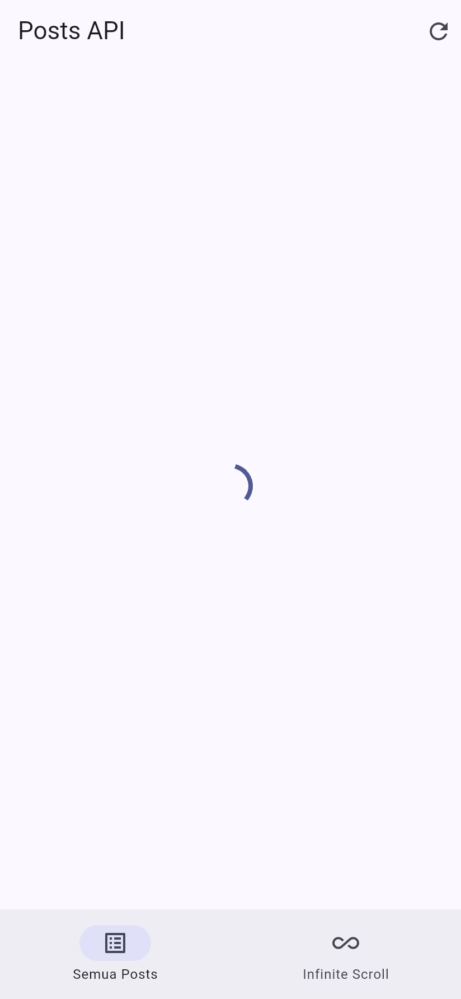
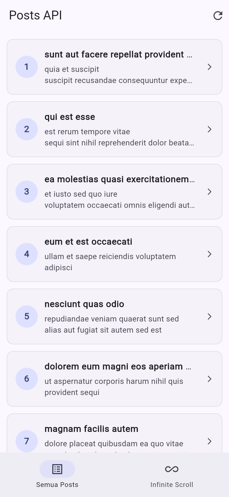
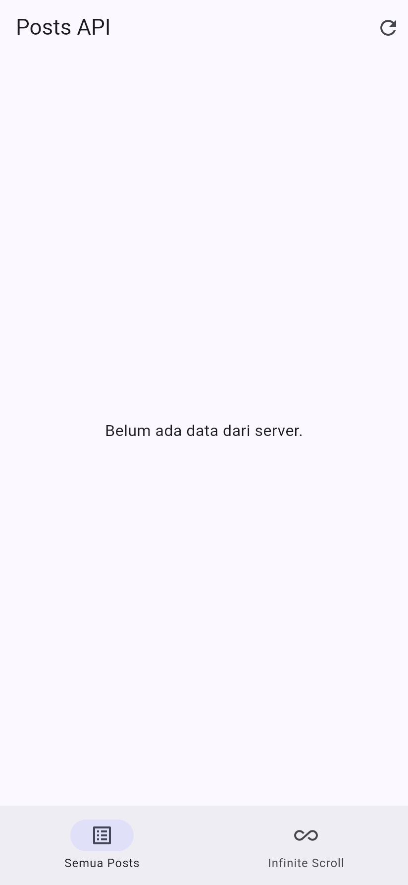
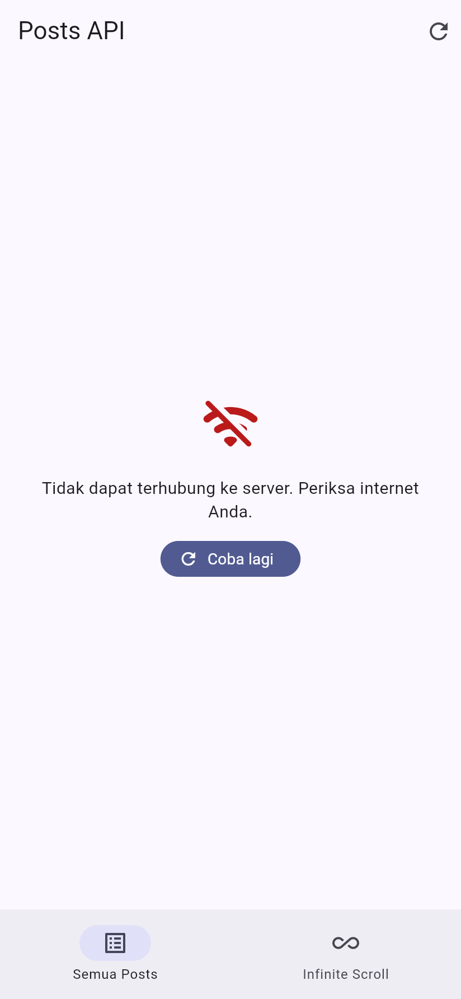
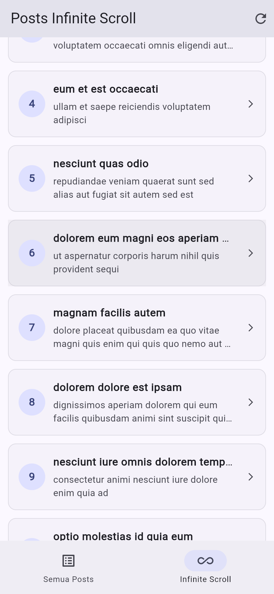
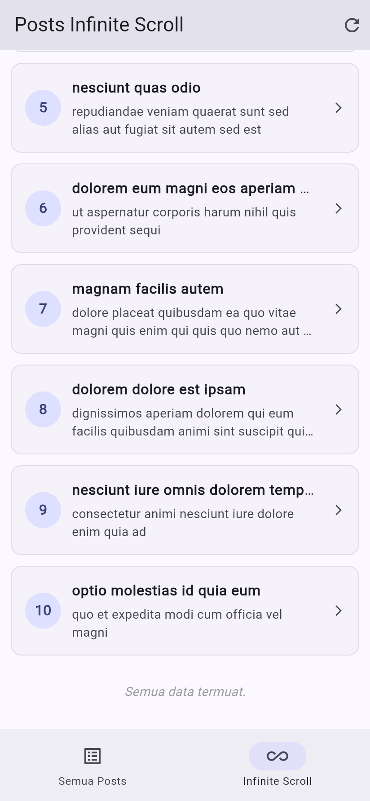
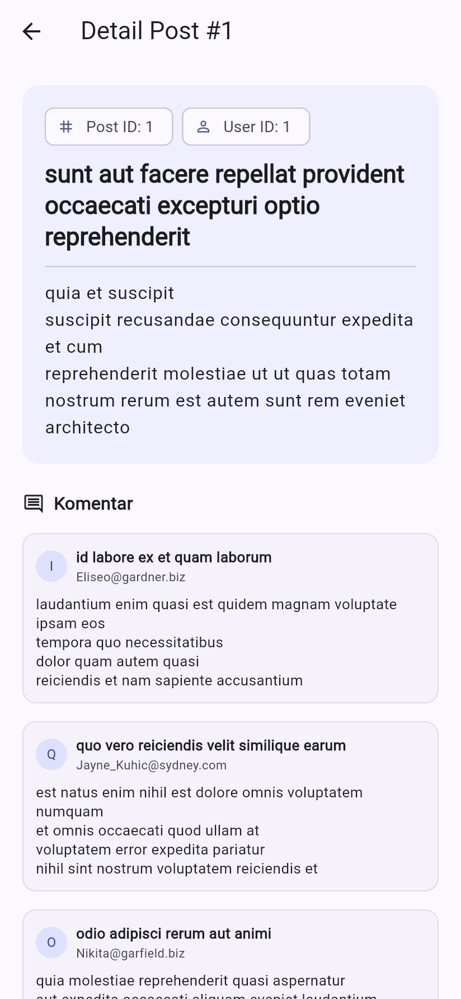
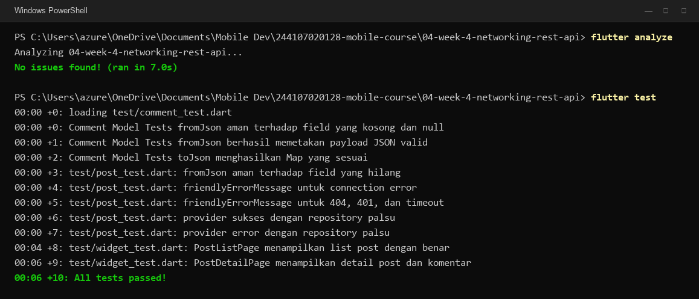

# Laporan Praktikum — Minggu 04: Networking & REST API

- **Nama:** Muhammad Aqil Azami
- **NIM:** 244107020128
- **Kelas:** TI-3H
- **Mata Kuliah:** Pemrograman Mobile

---

## 1. Deskripsi Tugas & Fitur
Di tugas minggu ke-4 ini, saya membuat aplikasi Flutter untuk mengambil dan mengelola data postingan dari REST API publik (JSONPlaceholder) dengan menerapkan Repository Pattern dan state management Riverpod.

Fitur utama yang dibuat:
1. **Klien Dio Terpusat:** Konfigurasi Dio dipusatkan pada `lib/data/api_client.dart` lengkap dengan base URL, timeout 10 detik, dan logging interceptor.
2. **Model Data Aman Null:** Model `Post` dan `Comment` diparsing secara defensif (`?? ''` dan `?? 0`) agar aplikasi tidak crash saat ada field null atau hilang dari API.
3. **Penanganan 4 State UI:** Tampilan `PostListPage` menangani 4 kondisi secara lengkap (loading spinner, daftar post berhasil dimuat, data kosong, dan tampilan error dengan tombol coba lagi).
4. **Pagination (Infinite Scroll):** Mengambil data secara bertahap (10 item per halaman) saat pengguna menggulir layar ke bawah.
5. **Halaman Detail & Komentar:** Menampilkan detail postingan yang dipilih beserta daftar komentar terkait lewat endpoint `/comments?postId={id}`.

---

## 2. Hasil Tampilan Aplikasi

### A. Penanganan 4 State (Loading, Sukses, Kosong, Error)
| Loading State | Sukses Menampilkan Data |
| :---: | :---: |
|  |  |

| Data Kosong | Error Koneksi & Tombol Coba Lagi |
| :---: | :---: |
|  |  |

### B. Infinite Scroll & Halaman Detail
| Scroll Memuat Data Berikutnya | Batas Akhir Data Termuat | Halaman Detail Post & Komentar |
| :---: | :---: | :---: |
|  |  |  |

---

## 3. Refactoring & Eksplorasi AI
- **Pemisahan Komponen:** Item postingan dipisah ke `lib/widgets/post_tile.dart` dan fungsi penerjemah pesan error dipisah ke `lib/data/network_errors.dart` agar kode halaman tetap rapi dan mudah dibaca.
- **Eksplorasi AI:** Saya mencoba meminta AI membuat repository untuk komentar. Kode awal dari AI masih memakai casting langsung tanpa proteksi null dan membuat instance `Dio()` baru di dalam fungsinya. Kode tersebut saya perbaiki agar menggunakan client Dio terpusat dan casting yang aman null. Rincian prompt dan kodenya dicatat di [docs/ai_challenge.md](docs/ai_challenge.md).

---

## 4. Pengujian Otomatis

Pengecekan kerapian sintaks dan pengujian otomatis dijalankan melalui terminal:
```powershell
flutter analyze
flutter test
```

| Hasil Pengecekan Linter & Test (10/10 Passed) |
| :---: |
|  |

Seluruh 10 pengujian (model, error handler, fake repository, dan widget test) berhasil lulus dan linter bersih tanpa isu.

---

## 5. Refleksi

1. **Kenapa UI dilarang panggil Dio langsung?**  
   Biar urusan tampilan tidak bercampur dengan urusan jaringan. Kalau sewaktu-waktu URL endpoint atau cara kirim datanya berubah, kita cukup ubah file repository saja tanpa perlu mengacak-acak kode widget UI.

2. **Kapan pakai pagination client vs server?**  
   Pagination client cocok kalau jumlah datanya sedikit (misal di bawah 50–100 data). Tapi kalau datanya ada ratusan atau ribuan, wajib pakai pagination server (`_page` dan `_limit`) supaya hemat kuota internet dan HP pengguna tidak berat saat memuat data.

3. **Gimana error repository jadi `AsyncError` tanpa try-catch di UI?**  
   Karena method `build()` di `AsyncNotifier` Riverpod secara otomatis menangkap exception yang dilempar oleh repository lalu mengubahnya jadi `AsyncError`. Di sisi UI, kita tinggal memanfaatkan fungsi `.when(error: ...)` untuk menampilkannya.

4. **Bagian kode AI apa yang diperbaiki?**  
   Model `Comment.fromJson` bawaan AI awalnya masih memakai casting langsung (`json['name'] as String`). Kalau dari API datanya null, aplikasi bakal langsung crash. Jadi saya perbaiki pakai fallback nilai default (`?? ''`) dan repository-nya saya sambungkan ke Dio terpusat bawaan project.
