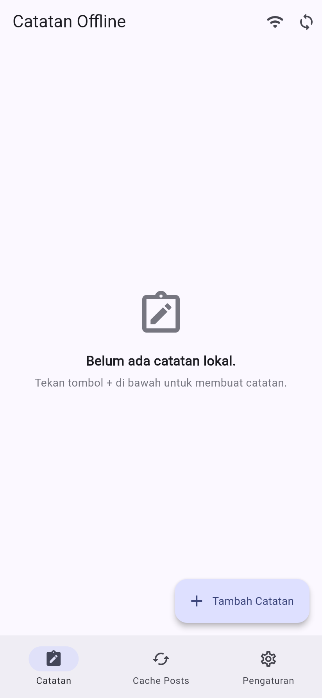
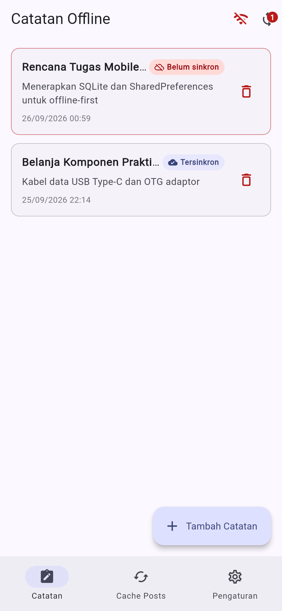
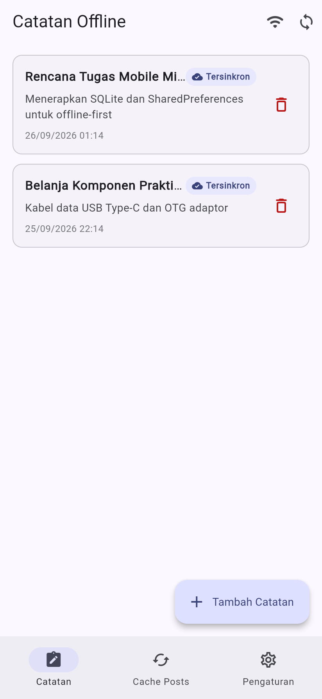
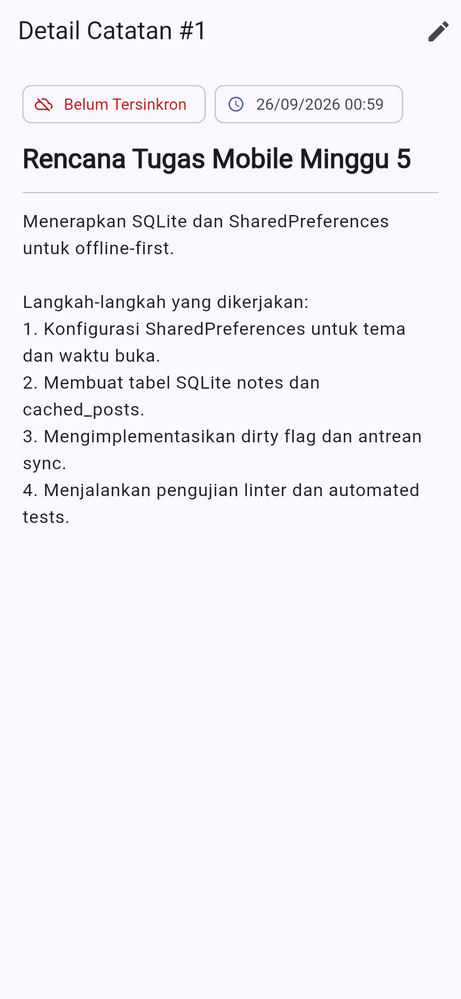
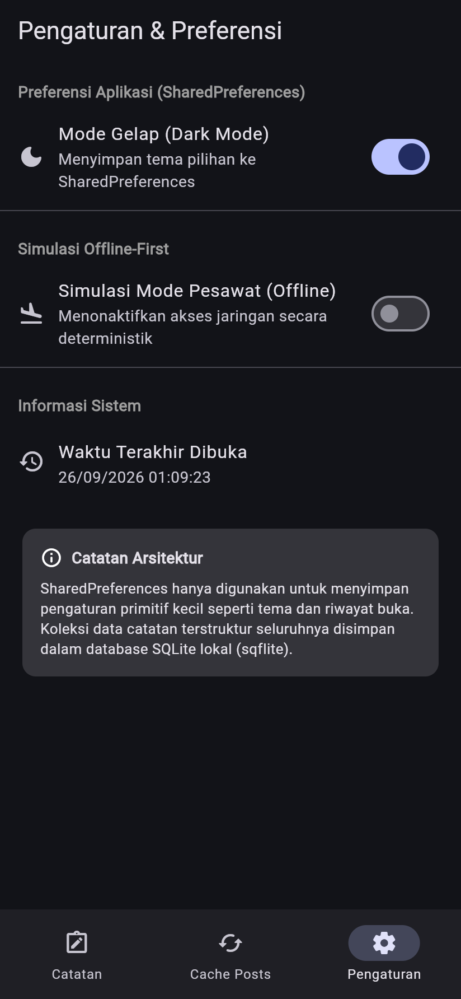
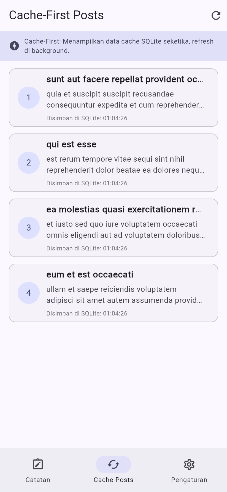
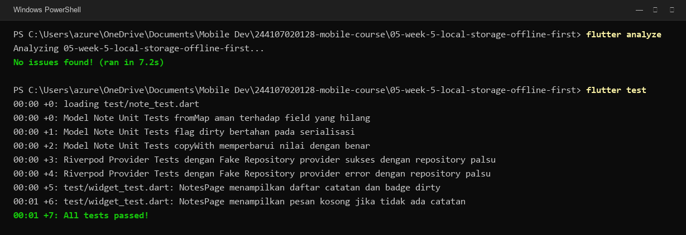

# Laporan Praktikum — Minggu 05: Local Storage & Offline-First

- **Nama:** Muhammad Aqil Azami
- **NIM:** 244107020128
- **Kelas:** TI-3H
- **Mata Kuliah:** Pemrograman Mobile

---

## 1. Deskripsi Tugas & Fitur Utama
Di praktikum minggu ke-5 ini, saya membuat aplikasi **Offline Notes** berbasis Flutter yang menerapkan konsep offline-first. Aplikasi ini memadukan SQLite (`sqflite`) untuk menyimpan data catatan dan `shared_preferences` untuk pengaturan preferensi pengguna:

1. **Preferensi Aplikasi (SharedPreferences):** Menyimpan pilihan tema gelap/terang (*dark mode*) dan mencatat waktu aplikasi terakhir dibuka.
2. **Database Lokal (SQLite):** Mengelola CRUD catatan lokal pada tabel `notes` yang otomatis diurutkan berdasarkan `updated_at DESC`.
3. **Mekanisme Offline-First & Sinkronisasi:**
   - **Dirty Flag:** Catatan baru atau editan saat offline otomatis ditandai `dirty = 1`.
   - **Antrean Sync (`syncNotes`):** Mengunggah data yang belum tersinkron dan memperbarui statusnya menjadi `dirty = 0`.
   - **Aturan Konflik:** Menggunakan aturan *Last-Write-Wins* berdasarkan timestamp `updated_at`.
   - **Simulasi Offline:** Switch mode pesawat di dalam aplikasi agar skenario offline bisa diuji kapan saja tanpa perlu mematikan Wi-Fi laptop.
4. **Cache-First Read:** Menampilkan data postingan yang tersimpan di tabel `cached_posts` SQLite seketika saat aplikasi dibuka, lalu melakukan pembaruan data di latar belakang.
5. **Halaman Detail Catatan:** Navigasi ke halaman detail `/note/:id` menggunakan GoRouter yang membaca data langsung dari database lokal.

---

## 2. Hasil Tampilan Aplikasi

### A. Catatan Offline & Sinkronisasi
| Catatan Kosong | Catatan Belum Sinkron (Offline) | Sinkronisasi Berhasil |
| :---: | :---: | :---: |
|  |  |  |

### B. Detail Catatan, Pengaturan Tema, dan Cache-First
| Detail Catatan (`/note/:id`) | Pengaturan & Mode Gelap | Cache-First Posts (SQLite) |
| :---: | :---: | :---: |
|  |  |  |

---

## 3. Refactoring & Eksplorasi AI
- **Pemisahan Komponen:** Item catatan saya pisah ke file tersendiri di `lib/widgets/note_tile.dart` lengkap dengan badge status belum tersinkron. Logika sinkronisasi dan cache API juga dipisahkan ke `lib/data/sync.dart` supaya file repository tetap rapi dan fokus ke operasi CRUD database.
- **Eksplorasi AI:** Saya mencoba meminta AI membandingkan SharedPreferences, Hive, SQLite, dan Drift. AI awalnya menyarankan Drift dan melewatkan kolom `dirty` untuk sinkronisasi. Saran tersebut saya tolak dan kodenya saya sesuaikan sendiri agar punya kolom `dirty` dan `updated_at`. Rincian perbandingannya dicatat di [docs/ai_challenge.md](docs/ai_challenge.md).

---

## 4. Pengujian Otomatis

Pengecekan linter dan pengujian logika dijalankan melalui terminal:
```powershell
flutter analyze
flutter test
```

| Hasil Pengecekan Linter & Pengujian (7/7 Passed) |
| :---: |
|  |

Seluruh 7 pengujian otomatis (unit test model `Note`, serialisasi dirty flag, fake repository provider, dan widget test) lulus 100% serta linter bersih tanpa error/warning.

---

## 5. Refleksi

1. **Mengapa daftar catatan tidak boleh disimpan di SharedPreferences? Apa yang rusak jika aturan ini dilanggar?**  
   SharedPreferences itu memang cuma cocok untuk data key-value sederhana (seperti boolean tema atau string kecil). Kalau daftar catatan dipaksa disimpan di SharedPreferences, semua datanya harus diubah jadi satu string JSON panjang. Akibatnya aplikasi jadi boros memori, tidak bisa filter atau sort data secara parsial, dan rawan rusak (*corrupt*) kalau aplikasi tiba-tiba tertutup di tengah proses serialisasi.

2. **Kapan cache-first cukup, dan kapan Anda membutuhkan strategi lain (misalnya network-first)?**  
   Strategi *cache-first* pas banget untuk data yang jarang berubah dan mengutamakan kecepatan tampilan saat dibuka, contohnya artikel berita, catatan pribadi, atau info profil. Tapi kalau datanya menyangkut hal sensitif yang wajib akurat secara *real-time* seperti harga saham, tiket konser, atau saldo dompet digital, kita wajib pakai *network-first* agar pengguna tidak melihat data usang.

3. **Bagaimana dirty flag berubah menjadi antrean sync tanpa memblokir UI? Kapan antrean terpisah (tabel outbox) menjadi perlu?**  
   Catatan yang diubah saat offline ditandai `dirty = 1`. Saat proses sync berjalan, aplikasi mengambil data bertanda `dirty = 1` lalu mengirimkannya secara *asynchronous* lewat `Future` di latar belakang, jadi layar aplikasi tidak akan macet/freeze. Tabel antrean terpisah (*outbox*) baru dibutuhkan saat alur transaksinya kompleks (misal satu data diubah lalu dihapus secara berurutan) agar urutan eksekusinya di server tidak tertukar.

4. **Bagian mana dari rekomendasi AI yang Anda tolak, dan mengapa?**  
   Saya menolak saran AI yang merekomendasikan package `Drift`. Drift memerlukan dependensi `build_runner` yang membuat proses kompilasi project jadi jauh lebih lama dan terlalu berat untuk kebutuhan catatan ini. Selain itu, skema awal buatan AI belum punya kolom `dirty` dan `updated_at`, jadi skemanya saya rombak sendiri agar mendukung antrean sinkronisasi offline-first.
