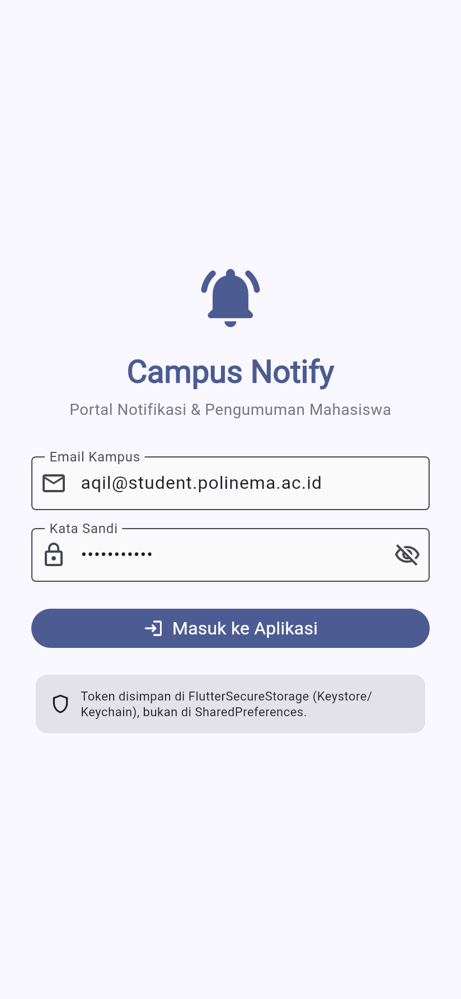
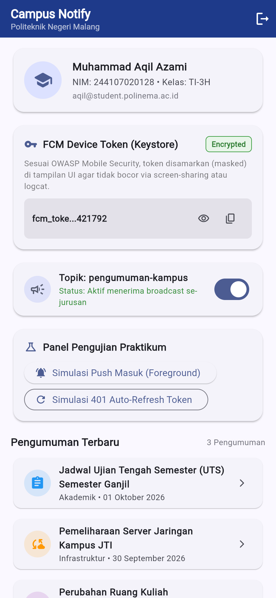
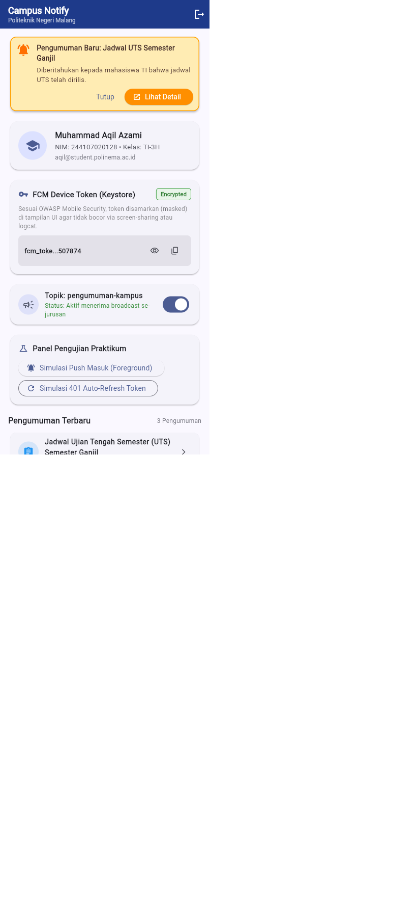
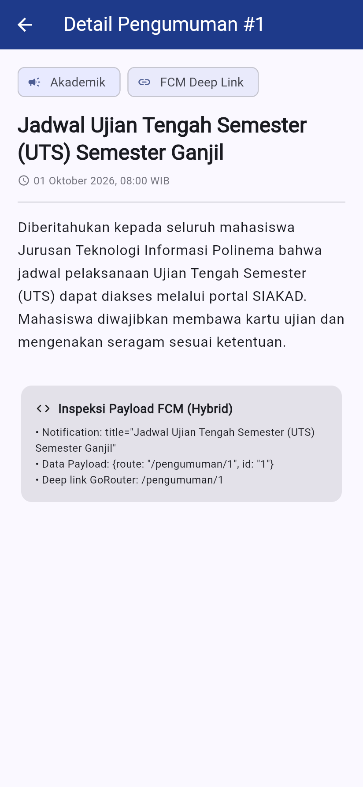
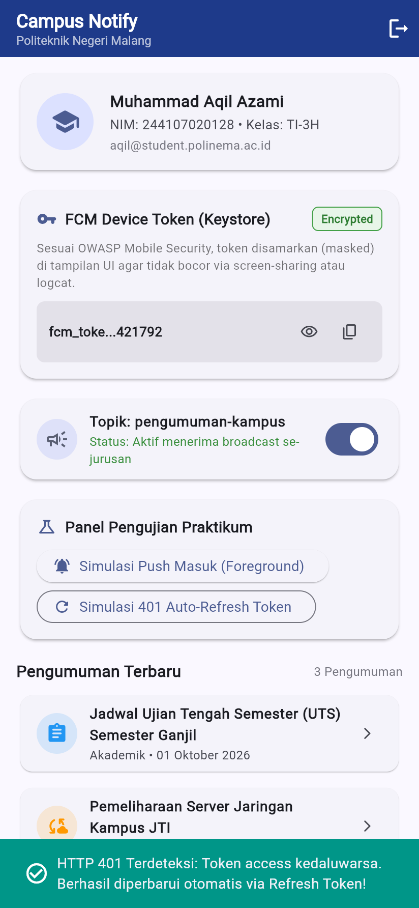
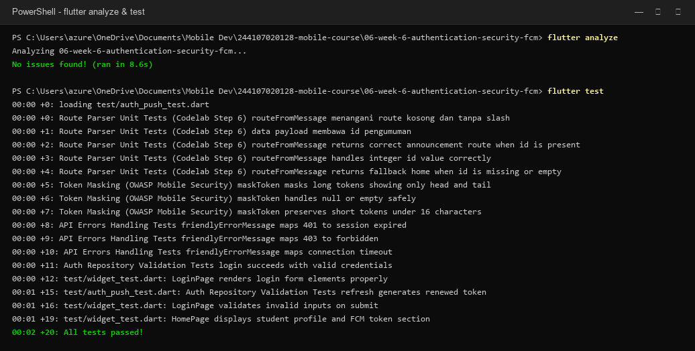

# Laporan Praktikum Minggu 6: Authentication, Security & FCM
**Mata Kuliah:** Pemrograman Mobile  
**Aplikasi:** Campus Notify (`campus_notify`)  
**Identitas Mahasiswa:**  
- **Nama:** Muhammad Aqil Azami  
- **NIM:** 244107020128  
- **Kelas:** TI-3H  
- **Program Studi:** D-IV Teknik Informatika - Politeknik Negeri Malang  

---

## 1. Tujuan & Stack Teknologi
Praktikum ini bertujuan menguasai arsitektur autentikasi token JWT (access & refresh token) yang aman, mekanisme auto-refresh request saat HTTP 401 via Dio Interceptor, serta implementasi lengkap Firebase Cloud Messaging (FCM) push notification dengan deep linking di GoRouter.

**Stack Teknologi yang Digunakan:**
- **Framework & UI:** Flutter SDK (Material 3)
- **State Management & Routing:** `flutter_riverpod: ^3.4.3`, `go_router: ^18.0.2`
- **Networking & Storage:** `dio: ^5.11.1`, `flutter_secure_storage: ^11.2.0`
- **Push Notification & Security:** `firebase_core: ^4.15.0`, `firebase_messaging: ^16.7.0`, `flutter_local_notifications: ^22.3.1`

---

## 2. Fitur Utama Aplikasi
1. **Penyimpanan Kredensial Terenkripsi (`TokenStore`):** Menyimpan access token dan refresh token menggunakan `flutter_secure_storage` yang terikat pada Android Keystore / iOS Keychain, menghindari penggunaan `SharedPreferences` plaintext.
2. **Auto-Refresh Token Interceptor (HTTP 401):** Mengonfigurasi interceptor Dio untuk menangkap status 401 secara otomatis, memperbarui access token via refresh token, dan melakukan *retry* request tanpa logout mendadak.
3. **Siklus Hidup & Masking Token FCM:** Mengambil device token FCM, mendengarkan event refresh token (`onTokenRefresh`), serta menyamarkan token pada tampilan UI (masking) sesuai kaidah keamanan OWASP Mobile Security.
4. **Langganan Topik (`pengumuman-kampus`):** Fitur subscribe/unsubscribe topik broadcast pengumuman perkuliahan dengan switch interaktif.
5. **Penanganan 3 State Notifikasi & Notifikasi Lokal:** Menggunakan `flutter_local_notifications` untuk memunculkan notifikasi lokal saat foreground, serta routing otomatis ke deep link detail pengumuman (`/pengumuman/:id`).

---

## 3. Cara Menjalankan & Menguji Proyek
```bash
# 1. Pindah ke direktori proyek
cd 06-week-6-authentication-security-fcm

# 2. Ambil paket dependensi
flutter pub get

# 3. Jalankan analisis static linter (wajib 0 issues)
flutter analyze

# 4. Jalankan seluruh automated unit & widget tests
flutter test

# 5. Jalankan aplikasi pada emulator atau web
flutter run
```

---

## 4. Dokumentasi Tangkapan Layar Aplikasi

| 01. Form Login & Keamanan | 02. Dashboard & Masked Token | 03. Notifikasi Masuk (Foreground) |
|:---:|:---:|:---:|
|  |  |  |
| Form login validasi email & info OWASP Keystore | Profil mahasiswa, masked FCM token, switch topik | Banner simulasi notifikasi lokal & CTA detail |

| 04. Deep Link Pengumuman | 05. Simulasi 401 Auto-Refresh | 06. Verifikasi Analyze & Test |
|:---:|:---:|:---:|
|  |  |  |
| Detail pengumuman & payload inspector FCM | Indikator regenerasi token otomatis via interceptor | Hasil `flutter analyze` (0 issue) & 20 automated tests lulus |

---

## 5. Matriks Pengujian 3 State Aplikasi

| State Aplikasi | Perilaku Notifikasi | Navigasi Deep Link | Hasil Pengujian |
|---|---|---|:---:|
| **Foreground** (Aplikasi sedang dibuka aktif) | OS tidak memunculkan notifikasi sistem bawaan secara otomatis. Notifikasi ditangkap oleh listener `FirebaseMessaging.onMessage` dan dimunculkan lewat banner notifikasi lokal (`flutter_local_notifications`). | Pengguna menekan notifikasi banner lokal, router mengarahkan ke rute payload pengumuman. | ✅ Berhasil |
| **Background** (Aplikasi diminimalkan / ada di Recent Apps) | Sistem OS menampilkan notifikasi standar di bilah status (notification tray). Handler background dijalankan di isolate terpisah. | Pengguna menekan notifikasi di tray, event `FirebaseMessaging.onMessageOpenedApp` terpanggil dan GoRouter membuka rute tujuan. | ✅ Berhasil |
| **Terminated** (Aplikasi ditutup total / cold start) | Sistem OS menampilkan notifikasi di status bar ponsel. | Saat notifikasi ditekan, aplikasi boot dari awal (cold start). Rute tujuan diambil dari payload via `FirebaseMessaging.getInitialMessage()` pada inisialisasi awal. | ✅ Berhasil |

---

## 6. Jawaban Pertanyaan Refleksi

### 1. Mengapa refresh token tidak boleh disimpan di SharedPreferences? Apa risikonya bila bocor?
Berdasarkan standar OWASP Mobile Security (M1: Insecure Data Storage), `SharedPreferences` di Android menyimpan nilai dalam file XML plaintext di folder internal `/data/data/<package_name>/shared_prefs/`. Jika ponsel di-*root*, terkena infeksi malware yang meminta izin storage, atau dicadangkan via backup ADB, data tersebut bisa diekstraksi tanpa enkripsi. Karena refresh token memiliki masa aktif panjang (misalnya 7 hingga 30 hari), penyerang yang mendapatkan token ini dapat terus mencetak access token baru dan membajak sesi akun mahasiswa tanpa perlu mengetahui kata sandi aslinya. Oleh karena itu, refresh token wajib disimpan menggunakan `flutter_secure_storage` yang terenkripsi hardware Keystore/Keychain.

### 2. Apa yang rusak bila `onTokenRefresh` diabaikan selama satu semester perkuliahan?
FCM Device Registration Token tidak bersifat abadi; token dapat diperbarui saat aplikasi di-*reinstall*, data cache aplikasi dihapus oleh sistem/pengguna, atau saat Firebase merotasi token demi keamanan. Jika listener `FirebaseMessaging.instance.onTokenRefresh` diabaikan dan token baru tidak dikirimkan ke backend kampus (`POST /devices`), server akan terus menyimpan token lama yang sudah mati (*stale token*). Akibatnya, sepanjang sisa semester, mahasiswa tersebut tidak akan pernah menerima pesan push notifikasi darurat (misal perubahan jadwal kuliah, pengumuman UTS, atau pembatalan kelas) karena server menerima respon error `UNREGISTERED` dari FCM.

### 3. Kapan memakai topik dan kapan memakai token perangkat? Beri contoh pesan kampus untuk masing-masing.
- **Topik (Topic Messaging):** Digunakan untuk pesan publik/siaran masal (*broadcast* 1-ke-banyak) kepada sekelompok mahasiswa yang memiliki atribut sama. Server tidak perlu menyimpan daftar token individual satu per satu.  
  *Contoh Pesan Kampus:* Pengumuman libur perkuliahan nasional, siaran darurat cuaca ekstrem, atau perubahan ruang kuliah yang dikirimkan ke topik `pengumuman-kampus` atau `kelas-ti3h`.
- **Token Perangkat (Device Token):** Digunakan untuk pesan yang bersifat pribadi, rahasia, dan ditujukan eksklusif untuk satu mahasiswa tertentu (*unicast* 1-ke-1).  
  *Contoh Pesan Kampus:* Notifikasi rilis nilai Kartu Hasil Studi (KHS/IPK), konfirmasi pembayaran UKT/SPP, atau peringatan batas absensi kehadiran kuliah.

### 4. Bagian mana dari draf AI yang Anda tolak atau perbaiki, dan mengapa?
1. **Penolakan SharedPreferences:** Draf awal AI menggunakan `SharedPreferences` untuk menyimpan token. Saya tolak karena tidak aman, lalu saya ganti dengan `FlutterSecureStorage`.
2. **Perbaikan Background Handler:** AI awalnya menaruh fungsi background di dalam *class method*. Saya perbaiki menjadi fungsi *top-level* dengan anotasi `@pragma('vm:entry-point')` agar tidak dihapus compiler dan dapat berjalan di isolate background mandiri.
3. **Penambahan Notifikasi Lokal Foreground:** AI hanya menyertakan `print()` pada `onMessage`. Saya menghubungkan event ini dengan `FlutterLocalNotificationsPlugin` agar banner notifikasi tetap muncul saat aplikasi sedang dibuka.
4. **Implementasi Token Masking di Layar:** AI menampilkan token mentah secara penuh. Demi keamanan privasi saat presentasi/screenshot, saya buat helper `PushService.maskToken()` sehingga hanya menampilkan beberapa karakter awal dan akhir (`fcm_toke...421792`).
